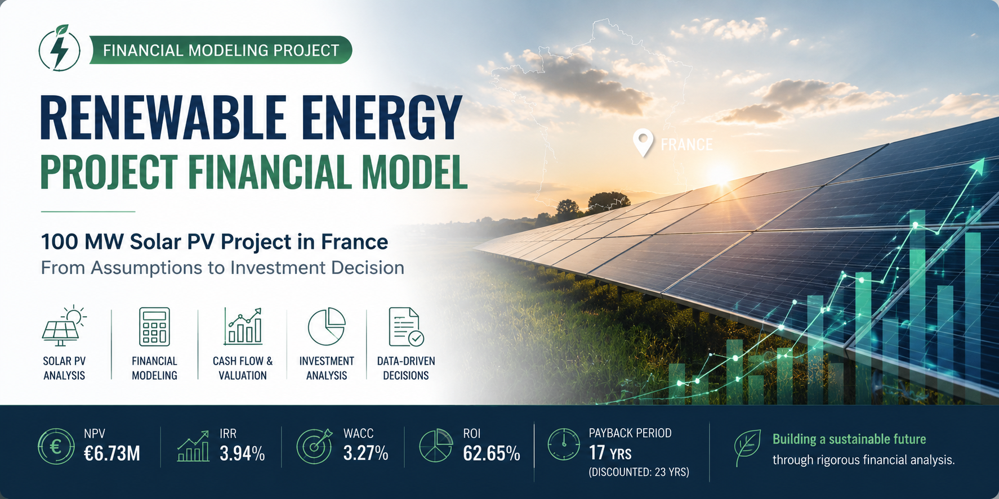

# Renewable Energy Project Financial Model

## Disclaimer
This project is a **personal portfolio case study** developed for educational and analytical purposes. It represents a simplified financial model based on publicly available data and modelling assumptions and should not be considered investment advice or a bankable project-finance model.

## Project Overview
This project evaluates the financial viability of a hypothetical 100 MWp utility-scale solar PV project in France over a 25-year operating period.
The objective was to build an end-to-end financial model translating technical and commercial assumptions into investment returns and a decision-oriented investment recommendation.

## Model Structure
The Excel model covers:
- Project and financial assumptions
- Electricity production modelling
- PPA-based revenue forecast
- Operating costs and EBITDA
- Depreciation schedule
- Debt financing schedule
- Unlevered Free Cash Flow (UFCF)
- DCF valuation
- NPV, IRR, ROI and payback analysis
- Sensitivity analysis

## Base-Case Assumptions

| Parameter | Base Case |
|---|---:|
| Installed Capacity | 100 MWp |
| Project Lifetime | 25 years |
| CAPEX | €85M |
| Capacity Factor | 14.1% |
| PPA Price | €59/MWh |
| Annual Degradation | 0.5% |
| System Losses | 14% |
| WACC | 3.27% |
| Corporate Tax Rate | 25% |

## Investment Results

| KPI | Result |
|---|---:|
| NPV | €6.73M |
| IRR | 3.94% |
| WACC | 3.27% |
| ROI | 62.65% |
| Simple Payback Period | 17 years |
| Discounted Payback Period | 23 years |
| Profitability Index | 1.08 |

The base case creates positive value, with NPV above zero and IRR exceeding the project's required return. However, the relatively narrow IRR–WACC spread and long discounted payback indicate limited downside protection.

## Sensitivity Analysis
The model tests the impact of changes in:
- PPA price
- CAPEX
- Capacity factor

The analysis shows that project value is particularly sensitive to revenue assumptions. A 10% decrease in either PPA price or capacity factor turns NPV negative.
PPA price and capacity factor sensitivities overlap in this simplified model because both have an equivalent proportional impact on revenue.

## Investment Recommendation

**Proceed with caution.**
The project is financially viable under the base-case assumptions. However, its limited margin of safety means that investment attractiveness depends strongly on securing PPA pricing, production performance and CAPEX close to the base case.

## Tools & Skills Demonstrated
**Excel Financial Modelling · DCF · NPV · IRR · WACC · Project Finance · Sensitivity Analysis · Investment Analysis · Renewable Energy**
